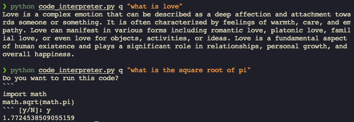

# Code Interpreter



Referenced from [Hacker's Guide to Large Language Models](https://youtu.be/jkrNMKz9pWU?si=nkcx6uQdA7Ue2bRK)

Read the accompanying [article](https://medium.com/bitgrit-data-science-publication/building-your-own-code-interpreter-in-python-ecda4ff5839c) for explanation of this code.

## How to run

install requirements

```bash
pip install -r requirements.txt
```

credentials

rename `.env.example` to `.env` and add your openai api key

```txt
OPENAI_API_KEY=your_openai_api_key
```

Run

```bash
python code_interpreter.py q 'your query'
```
